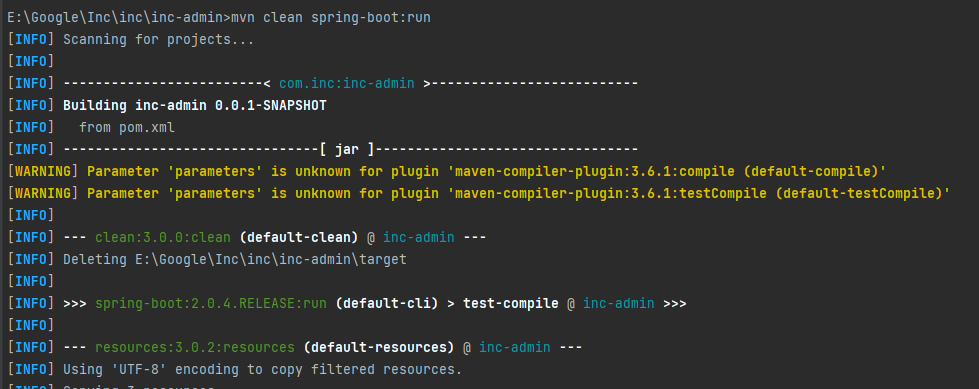

<p align="center">
    <a href='https://docs.oracle.com/en/java/javase/8'></a>
    <a href='https://docs.spring.io/spring-boot/docs/2.6.2-SNAPSHOT/reference/html'></a>
    <a href='https://staging-cn.vuejs.org'></a><br/>
    <a href='#'></a>
    <a href='#'></a>
    <a href='#'></a>
    <a href='#'></a>
</p>

# 电子书管理平台

#### 开发环境
Windows

#### 配置环境

| 程序           | 版本        | 说明                       |
|--------------|-----------|--------------------------|
| Jdk          | 1.8.0 161 | Java 开发工具包               |
| Mysql        | 5.5.27    | 关系型数据库                   |
| Apache-maven | 3.9.0     | Java 项目管理和构建工具           |
| Nvm          | 1.10      | Node.js 版本管理器            |
| Node         | 8.12.0    | Node.js JavaScript 运行时环境 |

#### 开发工具

| 工具                       | 版本            | 说明                      |
|--------------------------|---------------|-------------------------|
| IDEA                     | 2022.3.2      | 后前端开发IDE                |
| Git                      | 2.24.1        | 代码托管平台                  |
| Google   Chrome          | 75.0.3770.100 | 浏览器、前端调试工具              |
| Navicat                  | 11.1.13       | 数据库连接工具                 |
| Postman                  | 7.1.0         | 接口测试工具                  |
| VMware   Workstation Pro | 14.1.3        | 虚拟机(未用到或许你会用到)          |
| PowerDesigner            | 15            | 数据库设计工具(未用到或许你会用到)      |
| SQLyog                   | 12.0.3        | 数据库连接工具 (未用到或许你会用到)     |
| Visio                    | 2013          | 时序图、流程图等绘制工具(未用到或许你会用到) |
| ProcessOn                | ——            | 架构图等绘制工具(未用到或许你会用到)     |
| XMind   ZEN              | 9.2.0         | 思维导图绘制工具(未用到或许你会用到)     |
| RedisDesktop             | 0.9.3.817     | redis客户端连接工具(未用到或许你会用到) |

#### 编码规范

- 规范方式：严格遵守阿里编码规约。
- 命名统一：简介最大程度上达到了见名知意。
- 分包明确：层级分明可快速定位到代码位置。
- 注释完整：描述性高大量减少了开发人员的代码阅读工作量。
- 工具规范：使用统一jar包避免出现内容冲突。
- 代码整洁：可读性、维护性高。


#### 编码规范

- 规范方式：严格遵守阿里编码规约。
- 命名统一：简介最大程度上达到了见名知意。
- 分包明确：层级分明可快速定位到代码位置。
- 注释完整：描述性高大量减少了开发人员的代码阅读工作量。
- 工具规范：使用统一jar包避免出现内容冲突。
- 代码整洁：可读性、维护性高。
- 依赖版本：所有依赖均使用当前最新可用版本以便新技术学习。

#### 包的结构
```
 +- inc -- 整个项目
     +- inc-admin -- 后端
         +- src
         |   +- main
         |   |    +- java
         |   |    |    +- com
         |   |    |    |    +- inc
         |   |    |    |    |    +- admin
         |   |    |    |    |    |   +- aspect -- 切面类，实现 AOP 面向切面编程
         |   |    |    |    |    |   +- config --  配置类，包括 Spring 配置、Mybatis 配置、Swagger 配置等
         |   |    |    |    |    |   +- constants -- 常量类
         |   |    |    |    |    |   +- context -- Spring Context 相关类，用于获取 Spring 上下文信息
         |   |    |    |    |    |   +- controller -- 控制器类，处理 HTTP 请求
         |   |    |    |    |    |   +- dao -- 数据访问对象类，用于访问数据库
         |   |    |    |    |    |   +- domain -- 实体类，对应数据库中的表
         |   |    |    |    |    |   +- dto -- 数据传输对象，用于 Controller 与 Service 层之间传输数据
         |   |    |    |    |    |      +- sys
         |   |    |    |    |    |          +- req -- 请求 DTO，封装 HTTP 请求参数
         |   |    |    |    |    |   +- exception -- 异常类
         |   |    |    |    |    |   +- filters -- 过滤器类，实现 HTTP 请求过滤
         |   |    |    |    |    |   +- intercepter -- 拦截器类，实现拦截器功能
         |   |    |    |    |    |   +- service -- 服务类，处理业务逻辑
         |   |    |    |    |    |   +- task -- 定时任务类
         |   |    |    |    |    |   +- utils -- 工具类
         |   |    |    |    |    |   +- vo -- 视图对象，用于封装视图数据
         |   |    |    |    |    |   +- IncAdminApplication.java -- 应用程序入口类  
         |   |    +- resources
         |   |        +- mapper 
         |   |        |  +- sys --  Mybatis Mapper 接口，用于访问数据库
         |   |        +- application.yml -- 应用程序的配置信息，包括数据库连接、日志等
         |   |        +- application-dev.yml -- 开发环境配置文件
         |   |        +- application-pro.yml -- 生产环境配置文件
         |   |        +- spring-ehcache.xml -- Ehcache 缓存配置文件
         |   +- test
         |  	|	+- java -- 测试代码
         |  	|	    +- com 
         |  	|	        +- inc
         |  	|	            +- admin
         |  	|	                +- ClouddoAdminApplicationTests.java -- 测试应用程序的单元测试代码
         +- target -- Maven建项目时自动生成的目录
         +- inc.sql --  数据库脚本文件
         +- inc-admin.iml --  IntelliJ IDEA项目文件
         +- pom.xml -- Maven项目配置文件
     +- inc-view -- 前端
         +- .vscode -- 包含 Visual Studio Code 的项目设置和配置文件的目录
         +- build -- 包含项目构建相关的文件的目录
         +- config -- 包含 Vue 项目配置相关的文件的目录
         +- src
            +- api -- 包含与后端 API 交互的代码的目录
            +- assets -- 静态资源文件 如图片、字体等
            +- common -- 包含应用程序通用功能模块的目录
            +- components -- Vue 组件
            +- router -- 路由配置
            +- utils -- 包含应用程序工具函数的目录
            +- views -- 页面级组件
            +- vuex -- 包含 Vuex 状态管理器相关代码的目录
            +- App.vue -- 根组件 协调整个应用程序的视图和管理应用程序的状态
            +- bus.js -- 用于 Vue.js 组件之间通信的事件总线
            +- main.js -- 项目的入口文件
         +- static
            +- images
                +- cameras -- 包含摄像头图片资源的目录
         +- .babelrc -- Babel 配置文件，用于将 ES6+ 代码转换为兼容的 JavaScript 代码
         +- .editorconfig -- 编辑器配置文件，用于定义代码格式和风格的规则
         +- .postcssrc.js -- PostCSS 配置文件，用于定义样式的预处理器和后处理器
         +- index.html -- 应用程序的入口 HTML 文件
         +- install.bat -- Windows 系统下用于安装依赖包的批处理脚本
         +- packge.json -- 项目元数据的文件 用于描述 Node.js 应用程序或模块的属性
         +- packge-lock.json -- 锁定当前安装的包的版本号和依赖关系
         +- start.bat -- Windows 系统下用于启动应用程序的批处理脚本
     +- readme-- 项目说明文档
     +- .gitignore -- 指定需要 Git 忽略的文件或目录
     +- inc.iml-- IntelliJ IDEA 配置文件
     +- pom.xml -- Maven 配置文件
     +- README.md -- 项目的相关信息文档
     +- 系统安装部署文档V1.docx -- 应用程序的安装和部署说明文档。
 +- mybatis-generator-core -- 生成代码
```

#### 后端技术栈

| 技术                             | 版本            | 说明                          |
|--------------------------------|---------------|-----------------------------|
| Spring Boot Starter Parent     | 2.0.4.RELEASE | Spring Boot 父依赖             |
| MySQL Connector Java           | 未指定           | MySQL 驱动                    |
| MyBatis                        | 3.4.4         | ORM框架                       |
| MyBatis Spring Boot Starter    | 1.1.1         | MyBatis Spring Boot Starter |
| Apache Shiro                   | 1.3.2         | 安全框架                        |
| Fastjson                       | 1.2.42        | JSON处理工具                    |
| jjwt                           | 0.7.0         | JSON Web Token 处理工具         |
| Spring Boot Starter Websocket  | 未指定           | WebSocket依赖                 |
| Spring Context Support         | 未指定           | Spring上下文支持                 |
| Spring Boot Starter Security   | 未指定           | Spring Security依赖           |
| Ehcache                        | 3.8.1         | 缓存框架                        |
| ehcache                        | 未指定           | ehcache                     |
| PageHelper Spring Boot Starter | 1.2.3         | 分页插件                        |
| faker4j                        | 1.0.0         | 随机数据生成工具                    |
| Commons Collections4           | 4.1           | 集合处理工具                      |
| Commons IO                     | 1.4           | IO操作工具                      |
| Commons Fileupload             | 未指定           | 文件上传工具                      |
#### 前端技术栈

| 技术                                 | 版本         | 说明                                       |
|------------------------------------|------------|------------------------------------------|
| axios                              | ^0.16.2    | HTTP请求库                                  |
| echarts                            | ^3.7.1     | 可视化图表库                                   |
| element-ui                         | ^2.0.7     | 基于Vue.js的UI组件库                           |
| express                            | ^4.16.3    | 基于Node.js的Web应用框架                        |
| fabric                             | 2.3.6      | HTML5 Canvas 库                           |
| fabric-customise-controls          | 2.0.6-beta | Fabric.js 的自定义控件扩展库                      |
| lodash                             | ^4.17.4    | 实用工具库                                    |
| v-viewer                           | ^1.5.1     | 基于Viewer.js的Vue图片查看器组件                   |
| vue                                | ^2.5.9     | 前端JavaScript框架                           |
| vue-clipboard2                     | ^0.3.1     | 复制粘贴库                                    |
| vue-router                         | ^2.8.1     | Vue.js的官方路由器                             |
| vue-template-compiler              | ^2.5.9     | 将Vue.js模板编译为渲染函数的库                       |
| vuex                               | ^3.0.1     | Vue.js的状态管理库                             |
| autoprefixer                       | ^6.7.2     | 自动添加CSS3前缀的PostCSS插件                     |
| babel-core                         | ^6.26.0    | ES6转码器的核心库                               |
| babel-loader                       | ^6.2.10    | Webpack的Babel加载器                         |
| babel-plugin-transform-runtime     | ^6.22.0    | Babel插件，将ES6的函数替换为使用 babel-runtime 来优化代码 |
| babel-preset-env                   | ^1.6.0     | Babel的预设，根据当前的目标环境自动确定所需的插件              |
| babel-preset-stage-2               | ^6.24.1    | Babel的预设，包含ES7的部分特性                      |
| babel-register                     | ^6.26.0    | Babel的注册器，可以在运行时将ES6模块转换为ES5模块           |
| chalk                              | ^1.1.3     | 终端彩色输出库                                  |
| connect-history-api-fallback       | ^1.3.0     | 为HTML5历史API提供回退选项的中间件                    |
| copy-webpack-plugin                | ^4.0.1     | Webpack插件，用于将文件或文件夹复制到构建目录中              |
| css-loader                         | ^0.26.4    | 加载CSS文件的Webpack加载器                       |
| eventsource-polyfill               | ^0.9.6     | 用于WebSocket的EventSource polyfill         |
| extract-text-webpack-plugin        | ^2.1.2     | Webpack插件，用于从打包后的JS文件中提取CSS样             |
| file-loader                        | ^0.10.0    | 用于处理 webpack 中的文件依赖关系                    |
| friendly-errors-webpack-plugin     | ^1.1.3     | 友好显示 webpack 构建错误信息                      |
| function-bind                      | ^1.1.1     | ES6 函数绑定 polyfill                        |
| html-webpack-plugin                | ^2.30.1    | 用于生成 HTML 文件                             |
| http-proxy-middleware              | ^0.17.3    | http 代理中间件                               |
| node-sass                          | ^4.12.0    | sass 的 Node.js 绑定模块                      |
| opn                                | ^4.0.2     | 用于在 Node.js 中打开文件/URL 的模块                |
| optimize-css-assets-webpack-plugin | ^1.3.2     | 用于优化压缩 CSS 文件                            |
| ora                                | ^1.3.0     | 用于在控制台显示 loading 动画的模块                   |
| rimraf                             | ^2.6.2     | Node.js 中删除文件和文件夹的模块                     |
| sass-loader                        | ^6.0.6     | 用于处理 Sass 文件的 webpack loader             |
| semver                             | ^5.4.1     | Node.js 的版本管理工具                          |
| style-loader                       | ^0.16.1    | 用于将 CSS 添加到 DOM 的样式标签中                   |
| url-loader                         | ^0.5.9     | 用于将文件转换成 base64 URL 的 webpack loader     |
| vue-loader                         | ^11.1.4    | 用于处理 Vue.js 单文件组件的 webpack loader        |
| vue-style-loader                   | ^2.0.0     | 用于将 CSS 添加到 Vue.js 组件中的样式标签中             |
| webpack                            | ^2.7.0     | JavaScript 模块打包工具                        |
| webpack-bundle-analyzer            | ^2.9.0     | 用于分析 webpack 打包后的模块大小                    |
| webpack-dev-middleware             | ^1.12.0    | 用于在开发环境中将 webpack 打包后的文件暴露到 HTTP 服务器上    |
| webpack-hot-middleware             | ^2.19.1    | webpack 热更新中间件                           |
| webpack-merge                      | ^2.6.1     | 用于合并 webpack 配置的工具                       |

#### 安装教程
1.  在navicat中运行数据库脚本生成对应的数据库表
2.  在src/main/resources/application.yml文件里更改数据库名称或数据库密码
3.  在pom.xml文件的父目录运行 mvn clean spring-boot:run 启动后端
4.  启动前端 你可以在package.json的父目录执行下如命令 或者 直接在IDEA里点击也可运行 值得一提的是后两命令分别是打包命令和检查修复命令

```
npm install
```
```
npm run serve
```
```
npm run build
```
```
npm run lint
```
+ 如下图所示




#### 登录账户
用户名：admin
密码：1
#### 截图


#### 项目中需要说明的关键技术点

+ 在inc-view项目中index.html是所有页面的html,Home.vue是html中ID为app的DIV的所有内容里面包含头部左侧以及内容三大部分组成，其所有的组件均在view文件夹中

1. 此项目中前端是如何跳转页面的？
+ 通过router文件夹里的index.js配置实现与home.vue里的router-view元素相关联
2. 此项目中前端是如何获取后端的数据接口实现通信的？
+ 通过api文件夹里的各种上js以及各个组件中引入而后进行前后端数据通信的
3. 此项目中后端是如何给前端提交数据接口实现数据通信的？

#### 拓展知识

1. [什么是utf8mb4和utf8mb3区别？](https://blog.csdn.net/BLWY_1124/article/details/126093478)
2. [MySQL几种编码格式的区别（utf8、utf8mb4、utf8mb4_general_ci、utf8mb4_unicode_ci 、utf8mb4_0900_ai_ci）](https://cloud.tencent.com/developer/article/1872879)
3. [如何清除npm中的缓存](https://tech.mindseed.cn/Linux/802.html)
4. [解决：ERESOLVE unable to resolve dependency tree](https://blog.csdn.net/weixin_61465100/article/details/126528236)
5. [node node-sass sass-loader版本对应问题](https://zhuanlan.zhihu.com/p/479888799)
6. [nvm for windows 下载、安装及使用](https://juejin.cn/post/7074108351524634655)
7. [node安装和配置(node-v12.20.2-x64 ) 以及node版本切换介绍](https://blog.csdn.net/qq_30306717/article/details/121170387)
8. [nvm的下载与安装（保姆级）](https://blog.csdn.net/weixin_48844604/article/details/123282559)
9. [nvm安装，nvm的使用，nvm常用命令，nvm安装node报错，nvm切换不了，等系列集合](https://blog.csdn.net/muguli2008/article/details/107730766)
10. [如何用Windows命令提示符(cmd.exe)进入指定目录](https://blog.csdn.net/m0_46640386/article/details/109174414)
11. [如何使用nvm管理nodejs版本](https://blog.csdn.net/suwu150/article/details/79881503)
12. [nvm 查看所有可以下载node的版本](https://blog.csdn.net/qq_38463737/article/details/121364165)
13. [解决nvm 切换node版本切换不成功的问题](https://www.cnblogs.com/imMeya/p/14649938.html)
14. [win10中使用nvm安装nodejs遇到的坑整理](https://www.jianshu.com/p/5db570f53e6a)
15. [npm ERR! missing script: start](https://blog.csdn.net/qq_39699956/article/details/105494565)
16. [Java8原图片地址](https://img.shields.io/badge/Java%208-%234479A1.svg?logo=data:image/png;base64,iVBORw0KGgoAAAANSUhEUgAAAMgAAADICAMAAACahl6sAAABNVBMVEUAAABkmP9ml/9mmf9mmf9lmv9nmf9mmf9mmf9nmP9mmf9mmf9mmv9mmf9mmf9mmf9mmf9mmP9llv9mmf9mmf9mmv9mmf9mmf9mmf9mmf//AABlmf9mmf9km/9mmf9mmf9lmf9mmf9mmf//AABmmf9mmf9mmf9lmv9mmf//AABmmf9mmP9mmf9mmf//AABgl/9mmf//AABmmP//AABmmf//AAD/AABmmf9mmv9mmf//AABnmf//AAD/AAD/AABmmf//AAD/AABlmf9mmf//AABmmf9mmv9mmf//AAD/AAD/AABmmf//AAD/AAD/AAD/AAD/AAD/AAD/AAD/AAD/AABmmf//AAD/AAD/AABsof9mmf//AAD/AAD/AAD/AAD/AAD/AAD/AAD/AAD/AAD/AABmmf//AAB37HanAAAAZXRSTlMAP4CLnb8dtpUP2plK78zEpyoKrGbVbxj334BjRzL7sVA168C8hXlEIwvJYJBXQQahWC8k5M6nW1Q6Myb2ya5yY0gT0rp9dWpSEerm35JtH5l7Xhjnzo2EdATz2dOfiDst8AW1KD5Fo/kAAAl3SURBVHja3Ny7ruIwEAbg/zloU9FEiqJQoCQiEsUh4k4ESNw56H//R1gHlsQk8TnbrcdfS8OIsT2escB/MoEjlnDEfAQ3ZMUDTlgwhRvIIZyQcAcneDzc4QKPDOACj3TjLPHICC7wSMIFR5JOFFxUXDjcQyoXyJeRbpzteyoLyOdR6UO8kMoN8u2pjCGfR+UM8b5IOlE0jlkKId2aigt33YQl+X2UPUu3DYTzqThwrZokLMVXCLfk0xbC9fiUSy8Ye3zpQbYRXyLhha9P0oXqpIpjANGqOGLZd1yfdGKlB3QjsVZ8SyDZiW+55GnCxmMlxE/sPl/8gpULzL52X7DZiDUfBv0g5dnu3+P8exyT9SDmt92t4E36axzDWU4Wc1jtEv0WR5BSOVneUlnffo5jsTpSiexe5MCOmhBN/jKmYvsix2TAWjFBw/D1se2LHBgmrI3v+LQ582UPy2UFa0s0zKd8Omaw3IiabTPIMV8G1nfpVtT08GEx418r2G5Lzbw7q3iwPq1woiaAblJ9ltrf2vpmLQ+huySC7rsD1o74MLrxJbb9LFfmrHndfUbmPqy3/oc4pgKuu196HHfoepLaD48pK8nG8HvAfvcxK8W1ddTLGfHMWFtDd81JihmCBub6KpXUZ+xHrIwNtVcuIbF6rA2hu7Ik5gFKwsqp684r5dXcwtho6E+piHnaFLCStm9ZgqbSO9PWizHfBNSKevUe9xs5JysQz5RZGUkpPZPPQALjtnyCAN+mPbZHWXO3Hd8WxkBiCQ/7A7712/WJpDcPG77dW8eIrNl0tdo3rV1L1gZcrYWHuXZhJGCVLG6G0W1EUlSVMjMce1sKS65hdxsIGaUl18AwZjvwRcxL2cwwL5jxwxrWW/Jp2siex426qeXDaGUSdS/3FUlZx6LPp0O/3WDRWf7OobTv/qYZPxwtH63XO1dkmCrKGR8iPHQnT0rdAfbLYipF2AxwSp39k1Bg1H2rDaRtXMCuu6Y6U3OEBMvul/xj1nKIkHY2rK8FKzFk8Kj4HatH0gCuukwl7eSS1RiqSvcZGkYSX/oXHd2fkCVp/5Nw6yjYj+IyqxS3z72ZoEbdn3bu/HVpMI4D+Gf37S63uXRebSoeKCKoGQl+UyMpouiEIIhP//+fULoOc1/LdFsuev0ssrfu+Tx7ru15HHnmevUpmyeO7x6OTN6HvWH2Xony5OA9Wh+zMmiPuHP/RaSxP4Eserp/2fcys7R7i+d7Jfh1Zv+PrUd7cxCZ6tIj7n1vMNnO8SPQ/cdZrFdRD+9mYSvK7716kIHZrBM8ewOn8myKNn0p78EV+vACTmKQFQW/q6yHkBZ9QvKabxXaVFWAizVzBWYQ8JU6fiMJkDi9Q1u4xdkexGJCEm9hpyrhV7kmJEm3NRd3mJUOMRFgj0fjVxNICkGqGFIbQ0hMNdkkNUrEkELWIFEr/IqAuBkdDr+hdUgaiSEO4uVRLn7DlSBOswnpQES/jaE5xIks4HddiIs+DiruhnR+2UwsiI/Txj02XKqvV+c8J+IWz8IRGwzNYr1f962GcB5Bl/PBgBnhd0wJjhpgqAix4fHAhiNLApzCcGa1ZrVjL/nKjYIH6vNTfj4S4pPDWyiiakrkukfsaVZ7RbtBUvzA5JiXYr2ARyk+NYO0g0A+h3Gy6GLtLYTSCxKazjmMgctRnZoBpzCTqL8hLy/l8CwFV9UoexJGOJGVWN8ecjy5+KXptt0y/pZi+XSQlz0H/pyOobIASVsMm/JkXFyvlgHF01qFYziN7gYNu9iTiZrOCn24QIAhFbLNEDE0hmyzMVSBbGttIk09YQIkQsJQAOmQIRkTDHUhDbWgA8mYpFixFnMGSUiGjl9B8joWIgMJwZALiZtp+AUPiWhhyIfk+bj1Es5jEHMDjpIxJEHyKAyRLfhDrR7lK4jos7/pCN01pIDBr95JHQ9O05+upXYZv3nZhNs4NO50WUgDg3sKucqgS86LVcJrCZHaphPVfIMacBYe4lmIqIYfqxCQjhIeVX6n1EeuaL1sq6pYx1+pSwdR3lK4pRYhNaSCMVB8aj+KrOIXZhXS1OpeGqKyai5gz1DbtbkppE0nLTyTqNnDw4rMIyITVsH0TXi1gH9mZDaaAkTYCmrFFvxFfS/Pq8pJEXzJlh24FUk338I1YEur7oBru4eJynUx55t0l+x5BhznwPUxFuxsWCOmwxnrCH3477//dmT4F3gVFv4BXeThHzB+iSJk39RERAYyz8Md0oDTOQRcHUPFkEtNT8jSkle0qiDSLbgyxE/DXXpVrBK604dDwrBUJLWbMn5TJq+syhF4m3duzucq2kDiqSAYMGIBo5TuEK6Jieejp3A9HLyEWYKrwb7EsyldHa4IKZ6XYnB1T2f9jo9/SKTHBlyjaXCDJ+PsGlyDxWzKQlSJ4jb4OyOOkv/+4LdPLBlrU/5FvWFlcqCO8BYFkeHzUwEi0p6OEJpLroBflP1GpzRc/DLwrCn3Ouv5kgwV5S+fP0OHgLiVpDpuuVKqbVQbQJxmqzbuMHkBUtXDBsSmqZVxh25C2tZ4AzFheQypMqROt2IL0nH/4jYjwsK4bi0av2lC6sj41r67+B0J6SJ2JwlsiEUH91hrFlIyLPJt/ELyYI8Q25jp3aAKSRPkgNsgRmPAFM5H4aFRZUlAMgxdtmkLv8o19IMeWYbzzRi8RZmhGz1PgLiwRIfU1M1PK9YlOFDNvYVLkBYeU29rQYdw4DyOTkzyy67mi2X8mX/LfvsFhV24zNsxV8ejwnW1NqfxwXbPw5AV4FBfWLAzvTYNt9TOG4Fkqtaxr8xRX0JE5UVUDbjY21p+cFPAhI3MFdE/viHfifFOLlJmInmUnEn1WLidt8wlssk0zJMblTEG7rZq1BZw1GzOhHWfgMQIOtGzA5r7kumcAGSHYOHXpiSDoRwBqTAcvdacdOwlRZuc2s7dWKK7qSuF8v4eIcakqUa+V6q1BDhBlXbxq1wesunnQx3tLMYQagcHUxSpBEnqCxAztmTzzAZ/Vlk7kLQW/1JbVmcxHD2Ri6T2soAR5tiBVDjFShnR9TWeXPeaHmvAyQxWn05sSgtXTaJErSG/hRS1xpT/41IKoxumsqtMTWJPSa72xsW8PV8tKUnj2mK9jEe9U/l8zYDUhY8vtIUXU244mqz+9WXFfosYN/hKro5/aNQ2u6sx0bq6afldoqArbc+Dtm/EUeREaGET3n/rbc+4gP+iPgNo04Ue6Gbq9gAAAABJRU5ErkJggg==)
17. [项目说明md参考](https://gitee.com/nianxiassss/HIS)
18. [【Windows / macOS】 Clash for Windows 设置方法](https://order.yizhihongxing.org/index.php?rp=%2Fknowledgebase%2F27%2FWindows-or-macOS-Clash-for-Windows-%E8%AE%BE%E7%BD%AE%E6%96%B9%E6%B3%95-.html&language=czech)
19. [项目框架搭建二-前端（HTML，CSS，JavaScript，JQuery，AngularJS，Bootstrap，NodeJS，React，Vue）](https://blog.csdn.net/weixin_42426099/article/details/104102410)
20. [jquery和vue哪个简单(jquery和vue有什么区别)](https://www.shouxicto.com/article/127808.html)
21. [ElementUI的el-table怎样隐藏某一列](https://blog.csdn.net/BADAO_LIUMANG_QIZHI/article/details/107671407)
22. [HTML，css，js，vue的简单介绍](https://blog.csdn.net/Fengkx518/article/details/122473012)
23. [vue 项目html 与js,什么是VUE?VUE与JS的对比](https://blog.csdn.net/weixin_31509753/article/details/117944343)
24. [vue和js区别是什么](https://m.php.cn/article/472327.html)
